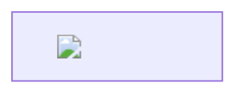

# Math/mermaid/id-injection

$$ \text{</math>} $$

```mermaid
graph TD
A["</foreignObject><img src=x onerror=alert(22)>"]
```

<a id='"onmouseover=alert(23)'>q</a>

[x]: javascript:alert(24)

")

<https://example.com/"onmouseover=alert(26)>

t
